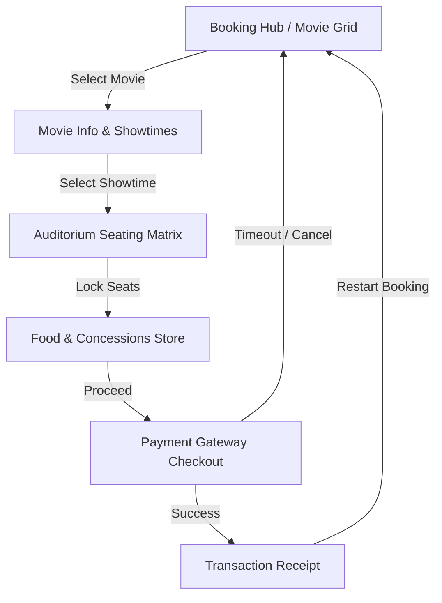

<div align="center">
  
</div>

# Miraj Cinemas POS Ticketing Hub

A premium, interactive web application simulating a modern movie theater Point of Sale (POS) and ticket booking experience. Built using React, TypeScript, and Tailwind CSS, it features dark/light mode toggles, an interactive SVG-based India map city selector, 3D swipeable card decks, custom-notch seat ticket morph animations, and a simulated food concessions checkout flow.

---

## 🚀 Tech Stack & Core Libraries

- **Framework:** [React](https://reactjs.org/) (TypeScript)
- **Build Tool & Dev Server:** [Vite](https://vite.dev/)
- **Styling:** [Tailwind CSS v4](https://tailwindcss.com/)
- **Icons:** [Lucide React](https://lucide.dev/)
- **Animations:** [Framer Motion](https://www.framer.com/motion/)

---

## 📂 Directory Layout

```text
miraj-cinemas-ticketing/
├── src/
│   ├── components/            # Interactive UI Components
│   │   ├── FoodConcessions.tsx   # Add snacks/drinks to order
│   │   ├── Footer.tsx            # Corporate footer
│   │   ├── Header.tsx            # Sticky navigation & city dropdown
│   │   ├── HeroBanner.tsx        # Spotlight interlocking card deck
│   │   ├── IndiaMap.tsx          # Interactive SVG selector map
│   │   ├── MirajLogo.tsx         # Vector brand logo
│   │   ├── MovieGrid.tsx         # Now Showing list & filter
│   │   ├── MovieInfo.tsx         # Synopsis & showtimes grid
│   │   ├── Offers.tsx            # Promotions view
│   │   ├── PaymentGateway.tsx    # Checkout form & countdown timer
│   │   ├── Receipt.tsx           # Printable transaction confirmation
│   │   ├── SeatingMatrix.tsx     # Theater seat selection matrix
│   │   └── UpcomingShows.tsx     # Coming soon movie preview list
│   ├── data/
│   │   └── mockData.ts        # Sample movies, concession food items, & seat generator
│   ├── App.tsx                # Main view router and booking context state
│   ├── index.css              # Custom keyframes & styling rules
│   ├── main.tsx               # Client entry point
│   └── types.ts               # Core TypeScript data type definitions
├── package.json               # Package dependencies & scripts
└── README.md                  # Project documentation (this file)
```

---

## 🔄 User Booking & State Flow

The application behaves as a single-page app (SPA) driven by the `activeView` state in [App.tsx](file:///d:/Miraj_demo/miraj-cinemas-ticketing/miraj-cinemas-ticketing/src/App.tsx):



### Route Views Detail:
- **`booking-hub`**: Features a premium interlocking 3D Spotlight Deck and a catalog of all showing movies.
- **`movie-info`**: Detailed view displaying movie rating, cast, trailer fallback, and dates/times grid.
- **`seating-matrix`**: Screen-anchored auditorium grid containing VIP recliners, Classic standard seats, and aisles.
- **`food-concessions`**: Option to purchase combos, snacks (popcorn/nachos), and beverages.
- **`checkout`**: Simulated credit/debit input with a 5-minute security lock timer.
- **`receipt`**: Confirmed booking invoice detailing selected seats, concessions, subtotal, and mock QR barcode.

---

## 🎨 Premium Visual Elements & Animations

### 1. Click-Outside Location Selector Dropdown
- Integrated inside the navigation header [Header.tsx](file:///d:/Miraj_demo/miraj-cinemas-ticketing/miraj-cinemas-ticketing/src/components/Header.tsx).
- Listens to document `mousedown` events using a React reference (`dropdownRef`) to close the city selector when clicking anywhere outside, avoiding blocking full-screen backdrop covers.
- Integrates an interactive SVG map of India highlighting target cinema regions on hover.

### 2. 3D Spotlight Card Deck
- Implemented in [HeroBanner.tsx](file:///d:/Miraj_demo/miraj-cinemas-ticketing/miraj-cinemas-ticketing/src/components/HeroBanner.tsx) using Framer Motion.
- Allows user swiping (drag mechanics on top card) to cycle through featured films.
- Non-active stack cards are layered with rotational offsets, scaling, and blur filters to simulate depth.

### 3. Radial-Gradient Ticket Morph Shapes
- Selected seats in [SeatingMatrix.tsx](file:///d:/Miraj_demo/miraj-cinemas-ticketing/miraj-cinemas-ticketing/src/components/SeatingMatrix.tsx) transition into a ticket shape.
- Utilizes CSS radial gradients (`.ticket-shape-selected-light` and `.ticket-shape-selected-dark` in [index.css](file:///d:/Miraj_demo/miraj-cinemas-ticketing/miraj-cinemas-ticketing/src/index.css)) on the left/right edges to create ticket-notch cutouts without needing image assets.
- Plays a custom `@keyframes ticket-morph` spring-scale pop transition on selection.

### 4. Transient Crying Deselect Shake
- Clicking on a selected seat deselects it and transitions it to a transient "crying" state for `1000ms`.
- Shows a crying emoji (`😢`) and shakes utilizing `@keyframes crying-shake` and `.animate-crying-shake`.
- Disables interaction/button clicks during the 1-second timeout to prevent fast-click input conflicts.

---

## 📊 Core Data Types & Models

Defined in [types.ts](file:///d:/Miraj_demo/miraj-cinemas-ticketing/miraj-cinemas-ticketing/src/types.ts):

- **`Movie`**: ID, title, certification (`U`/`UA`/`A`), genres, duration, synopsis, starring, director, accentColor, ratingScore, poster/backdrop URLs, and trailer metadata.
- **`Showtime`**: ID, start time, screenType (`IMAX 3D`, `GOLD VIP`, etc.), theater, standard pricing, and VIP pricing.
- **`Seat`**: ID (e.g. `A5`), row, col, type (`standard`, `vip`, `aisle`), and status (`available`, `booked`, `selected`).
- **`TransactionDetails`**: Mock billing invoice container including bookingId, items, totals, coupons, and timestamps.
- **`SelectedFoodItem`**: Wraps the concessions item and its quantity in checkout.

---

## 🛠️ Development & Deployment

### Run Locally

1. **Install dependencies:**
   ```bash
   npm install
   ```

2. **Configure environment (optional):**
   Create a `.env.local` file and specify parameters (e.g. `GEMINI_API_KEY`) if needed.

3. **Run developer server:**
   ```bash
   npm run dev
   ```
   *By default, the server runs on http://localhost:3000/*

4. **Verify TypeScript & Compilation:**
   ```bash
   npm run lint
   ```
